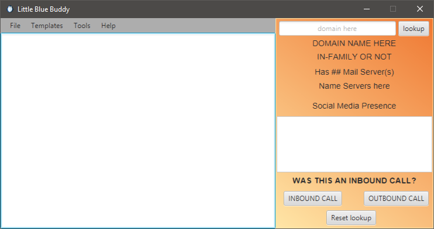
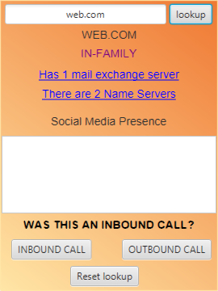
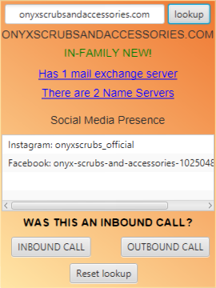
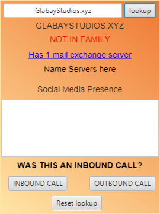
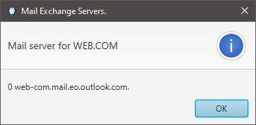
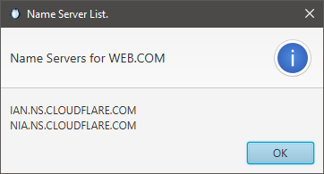
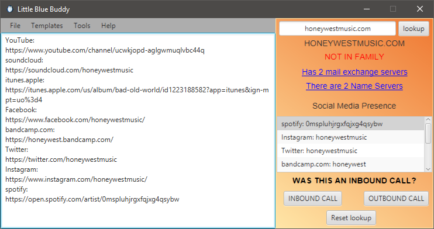
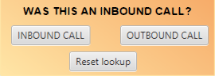
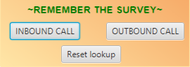
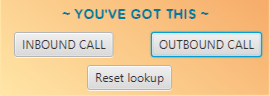

# Little Blue Buddy (DNS-Panel)

## DNS Panel
Here you will see the main window. On the left in the large blank white are is the JotPad; used to take notes while on the call.
On this window is the DNS Panel. To the right you will enter the domain of the customers existing website, and have some useful DNS information populate from an executed Who-Is lookup.

### Domain is within the family

### Domain is within the family and new!

### Domain is outside the family

The Blue Hyperlink for mail servers and Name Servers can be clicked for quick information about specific details.

## Social Presence
Here you will see on right in the white panel, we've scraped the domain for any social presence.
 If you left-click on the presence, it will be copied to the clipboard for fast and easy copying. These can be seen on the left JotPad
 If you happen to right-click on the presence, it will open the link in a new browser tab to confirm the link works and is accessible.

The Social presence we're looking for:
- Facebook
- YouTube
- Instagram
- Twitter
- LinkedIn
- Pinterest
- TikTok
- Reddit
- spotify
- soundcloud
- itunes.apple
- snapchat
- bandcamp.com

## End of Call Survey
A little helper when remembering if the call was inbound or not for that end of call survey

