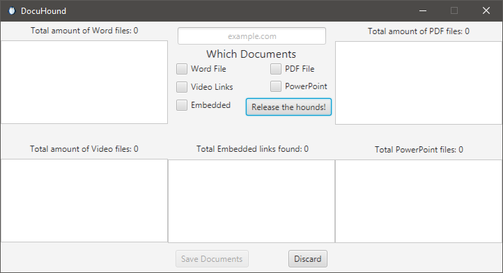
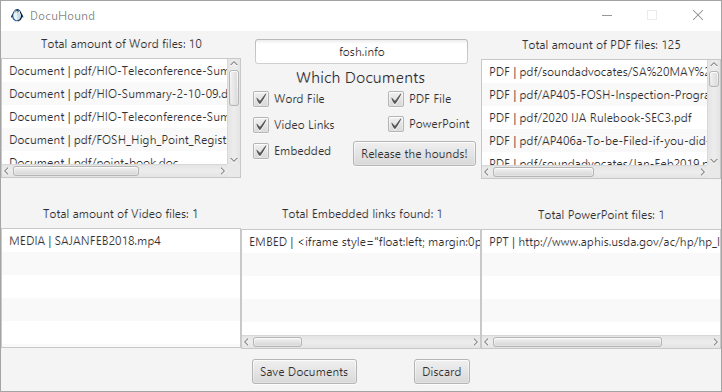
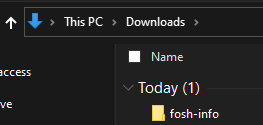
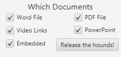

# Little Blue Buddy (DocuHound)

## Document Hounds
Here you are greeted with a window where you can enter the domain, and check off the filters you wish to apply. Then you will release the hounds to sniff out files and links.

Once a domain is provided, and you "_Release the hounds_", the pack leader will sniff out the robots.txt file for a sitemap link. If none is found we will then try to look at the domain/sitemap.xml
If a map is found then we will look over the sitemap links for anything that is a direct link to a file type we are looking for, else it will add to the list of links to assign out.
Once the sitemap has been sniffed and filtered the leader will assign a hound to run over each page for any href (hyperlink reference) that points to a file type we are looking for and stores it to pass back to the pack leader once the page is sniffed.
Once all the hounds have reported back to the leader with their findings the leader reports the findings back to the user in an informative manner.

When we "_Save Documents_" we will be creating a folder in the download folder of the Agent's computer, and naming it the domain; replacing the '_dot_' with a dash.

If there are any Embedded videos or links to YouTube videos/channels will be saved to a text file '_LilBlu_Links.txt_' within that file

 Once we've collected the links for the files to download. If we have more than 16 files to download, we will use multiple hounds to 'fetch' the files to download. This will be 16 files per hound and anything remaining after that will get a final hound to pick up the slack.
 Creating the document first, and then filling it with data allows for the clear view that if the file is empty, we have to ask the customer for the file; avoiding a Production Hold.

## Filter

The filter will search for document types based on the filter applied.

- Word Files
    - *.docx
    - *.doc
    - *.docm

- PowerPoint
    - *.ppt
    - *.pptx
    - *.potx
  

- Video Links
    - YouTube.com/user/*
    - YouTube.com/c/*
    - YouTube.com/watch/*
    - *.mov
    - *.mp4
    - *.avi