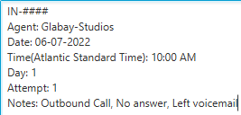

# Little Blue Buddy (Email & Templates)

## Email Exceptions

####    Exceptions
When we have to flip into a code for some reason, this tool makes reporting the reason easy.
 Exception Date: taken from today's date
 Exception Start: Taken from the current time when the window was open
 Exception Finish: Optional, this will be autofilled when "_Send Exception_" is pressed if it was not specifically entered.
 Using _Special Project_ as the default, you can choose from any of the phone codes
 _Approved by_ is an optional field, but if you were approved, enter the name of the approving person here
 When opened the cursor will autofocus on the _Reason_ field, so you can just quickly open and provide a reason, then send the exception.
 Clicking the send exception button will send your exception to the appropriate department

Once the email is sent, the receiving end will see the result (To & From emails were removed in the image)

####    Missed\Late Event
When reporting a missed Event, this tool makes sending the email very quick
 Event Date: taken from today's date
 Time Event was taken: Taken from the current time when the window was open
 Event Reporting:

When reporting a Workday event the window changes a little to fit the template:

## Templates

####    Follow-Ups
When we make a callback, this window will open and the only this you need to enter is the Case you were following up for, and any reason that isn't an outbound call, with no answer, and you left a voicemail.
 The date is autofilled with today's date.
 The time is taken from the current time of day when the window was opened.
 You can select the day and attempt, once the call is complete, click "_Copy to Clipboard_" to have it stored for a quick Ctrl+V into Pega.

The Template pasted into the JotPad for an example of the format.
 The '_Agent_' is taken from the logged-in user of the Computer.

####    Scheduled Callback
When we have to make a callback, this is the window that will be displayed

Once we fill in the required information and have the reasoning filled in.

The template copied to your clipboard or sent to Email

